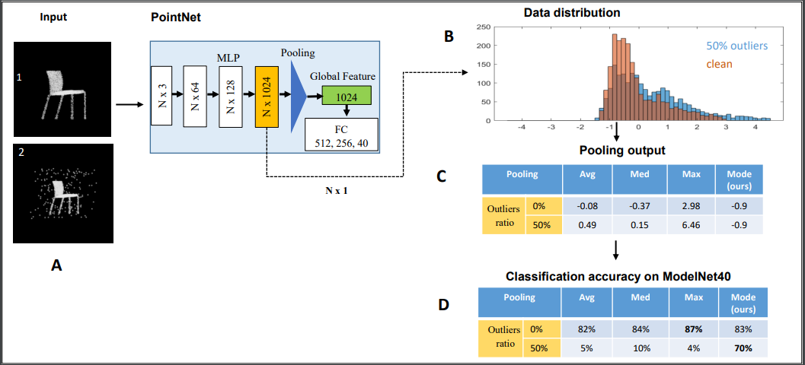

# Robust Pooling through the Data Mode

This repository contains a PyTorch implementation of historgram and RANSAC Pooling layers for robust point cloud classification. Both layers were tested with PointNet and DGCNN. More details can be found in [this paper](https://arxiv.org/abs/2106.10850v1). This code is mostly based on [Deep Declarative Netwroks](https://github.com/anucvml/ddn/tree/master/apps/classification/pointcloud). For requirements, please refere to their repository. 


 [main pic2](cover2.PNG)

## References
If you find our work useful in your research, please consider citing:
```
@article{mukhaimar2021robust,
  title={Robust Pooling through the Data Mode},
  author={Mukhaimar, Ayman and Tennakoon, Ruwan and Lai, Chow Yin and Hoseinnezhad, Reza and others},
  journal={arXiv preprint arXiv:2106.10850},
  year={2021}
}
```


## Requirements

- Install PyTorch ([pytorch.org](http://pytorch.org))
- `pip install -r requirements.txt`

## Segmentation
coming soon...

## classification

To train a model, run `main.py`:

```bash
python3 main.py --outlier_fraction [OUTLIER_FRACTION] --noise_level [NOISE_LEVEL] --miss_fraction [MISS_FRACTION] --robust_type [ROBUST_TYPE]
```

The ROBUST_TYPE can be RANSAC or Histogram {'RN', 'HS'} or none for max-pooling. Other pooling types introduced in DDN {'Q', 'PH', 'H', 'W', 'TQ'} can be used but the DDN library path needs to be added first. 

Default OUTLIER_FRACTION, NOISE_LEVEL, and MISS_FRACTION values are zero. Outliers are normally distributed in the unit cude. 


## Links
- [Declarative Netwroks](https://github.com/anucvml/ddn/tree/master/apps/classification/pointcloud)
- [Pointnet PyTorch repository](https://github.com/yanx27/Pointnet_Pointnet2_pytorch/tree/31deedb10b85ec30178df57a6389b2f326f7c970)
- [Official PointNet repository](https://github.com/charlesq34/pointnet)
